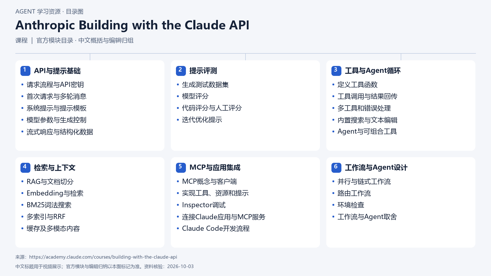

# Anthropic Building with the Claude API

[返回总目录](../../README.md) · [官网](https://academy.claude.com/courses/building-with-the-claude-api) · [学后评价](review.md)

状态：待开始个人学习。当前内容为资料整理，不代表课程已完成。

## 目录依据

官方目录（67个教学页按主题编辑归组，组内依课序）

[可编辑 SVG](../../assets/course_maps/svg/anthropic_claude_api.svg)

## 内容地图

### API与提示基础

- 请求流程与API密钥
- 首次请求与多轮消息
- 系统提示与提示模板
- 模型参数与生成控制
- 流式响应与结构化数据

### 提示评测

- 生成测试数据集
- 模型评分
- 代码评分与人工评分
- 迭代优化提示

### 工具与Agent循环

- 定义工具函数
- 工具调用与结果回传
- 多工具和错误处理
- 内置搜索与文本编辑
- Agent与可组合工具

### 检索与上下文

- RAG与文档切分
- Embedding与检索
- BM25词法搜索
- 多索引与RRF
- 缓存及多模态内容

### MCP与应用集成

- MCP概念与客户端
- 实现工具、资源和提示
- Inspector调试
- 连接Claude应用与MCP服务
- Claude Code开发流程

### 工作流与Agent设计

- 并行与链式工作流
- 路由工作流
- 环境检查
- 工作流与Agent取舍

## 相关研究

- [研究分析](../../research/agent_courses/providers/anthropic/analysis.md)（同一提供方可能涵盖多项资源）
- [详细章节地图](../../research/agent_courses/providers/anthropic/curriculum.md)（同一提供方可能涵盖多项资源）
- [证据与获取范围](../../research/agent_courses/providers/anthropic/evidence.md)（同一提供方可能涵盖多项资源）

## 我的学习记录

- [章节笔记](notes/README.md)
- [实践与 Demo](practice/README.md)
- [学后评价](review.md)

可以按 `notes/01-主题.md` 新建笔记；每次记录原课链接、理解、疑问与验证结果。
