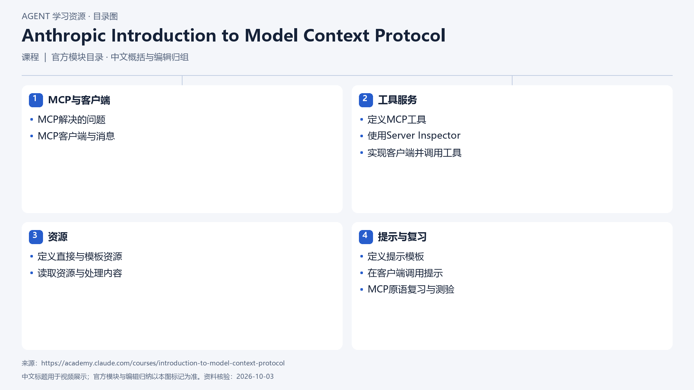

# Anthropic Introduction to Model Context Protocol

[返回总目录](../../README.md) · [官网](https://academy.claude.com/courses/introduction-to-model-context-protocol) · [学后评价](review.md)

状态：待开始个人学习。当前内容为资料整理，不代表课程已完成。

## 目录依据

官方目录（连续课次编辑归组，组内保持课序）

[可编辑 SVG](../../assets/course_maps/svg/anthropic_mcp_course.svg)

## 内容地图

### MCP与客户端

- MCP解决的问题
- MCP客户端与消息

### 工具服务

- 定义MCP工具
- 使用Server Inspector
- 实现客户端并调用工具

### 资源

- 定义直接与模板资源
- 读取资源与处理内容

### 提示与复习

- 定义提示模板
- 在客户端调用提示
- MCP原语复习与测验

## 相关研究

- [研究分析](../../research/agent_courses/providers/anthropic/analysis.md)（同一提供方可能涵盖多项资源）
- [详细章节地图](../../research/agent_courses/providers/anthropic/curriculum.md)（同一提供方可能涵盖多项资源）
- [证据与获取范围](../../research/agent_courses/providers/anthropic/evidence.md)（同一提供方可能涵盖多项资源）

## 我的学习记录

- [章节笔记](notes/README.md)
- [实践与 Demo](practice/README.md)
- [学后评价](review.md)

可以按 `notes/01-主题.md` 新建笔记；每次记录原课链接、理解、疑问与验证结果。
