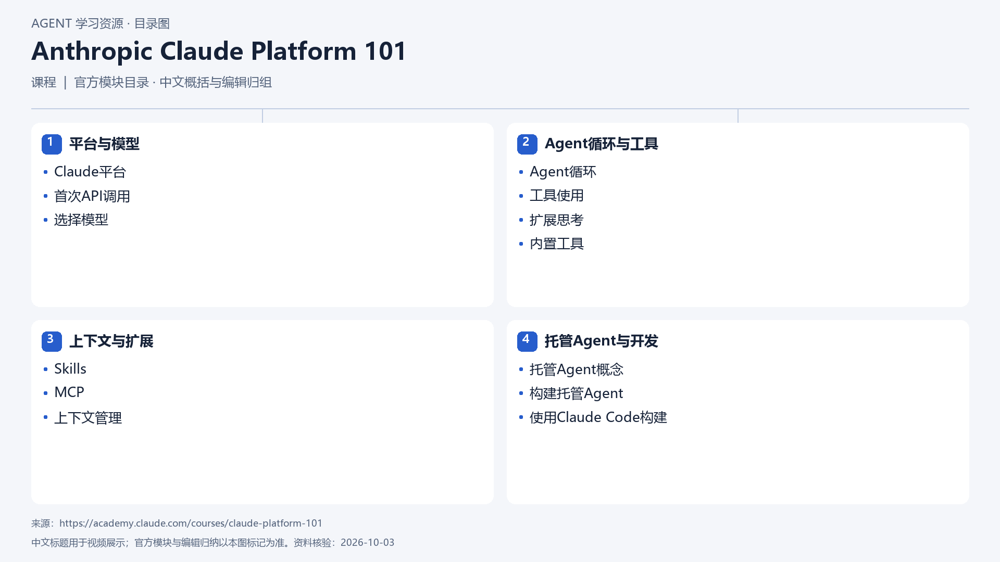

# Anthropic Claude Platform 101

[返回总目录](../../README.md) · [官网](https://academy.claude.com/courses/claude-platform-101) · [学后评价](review.md)

状态：待开始个人学习。当前内容为资料整理，不代表课程已完成。

## 目录依据

官方目录（连续课次编辑归组，组内保持课序）

[可编辑 SVG](../../assets/course_maps/svg/anthropic_platform_101.svg)

## 内容地图

### 平台与模型

- Claude平台
- 首次API调用
- 选择模型

### Agent循环与工具

- Agent循环
- 工具使用
- 扩展思考
- 内置工具

### 上下文与扩展

- Skills
- MCP
- 上下文管理

### 托管Agent与开发

- 托管Agent概念
- 构建托管Agent
- 使用Claude Code构建

## 相关研究

- [研究分析](../../research/agent_courses/providers/anthropic/analysis.md)（同一提供方可能涵盖多项资源）
- [详细章节地图](../../research/agent_courses/providers/anthropic/curriculum.md)（同一提供方可能涵盖多项资源）
- [证据与获取范围](../../research/agent_courses/providers/anthropic/evidence.md)（同一提供方可能涵盖多项资源）

## 我的学习记录

- [章节笔记](notes/README.md)
- [实践与 Demo](practice/README.md)
- [学后评价](review.md)

可以按 `notes/01-主题.md` 新建笔记；每次记录原课链接、理解、疑问与验证结果。
