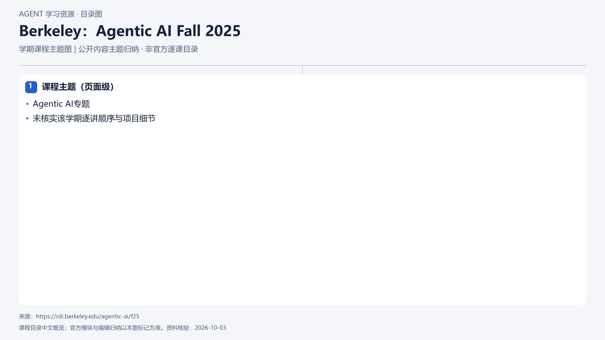

# Berkeley：Agentic AI Fall 2025

[返回总目录](../../README.md) · [官网](https://rdi.berkeley.edu/agentic-ai/f25) · [学后评价](review.md)

## 目录依据

已核实资料确认官方学期课程页与课程主题，但未提供逐讲目录或同等深度审阅；仅按页面级主题绘制。

[可编辑 SVG](../../assets/course_maps/svg/berkeley-agentic-ai-fall-2025.svg)

## 内容地图

### 课程主题（页面级）

- Agentic AI专题
- 未核实该学期逐讲顺序与项目细节

## 相关研究

- [研究分析](../../research/agent_courses/providers/berkeley/analysis.md)（同一提供方可能涵盖多项资源）
- [详细章节地图](../../research/agent_courses/providers/berkeley/curriculum.md)（同一提供方可能涵盖多项资源）
- [证据与获取范围](../../research/agent_courses/providers/berkeley/evidence.md)（同一提供方可能涵盖多项资源）

## 相关目录

- [章节笔记](notes/README.md)
- [实践材料](practice/README.md)
- [课程评估](review.md)
