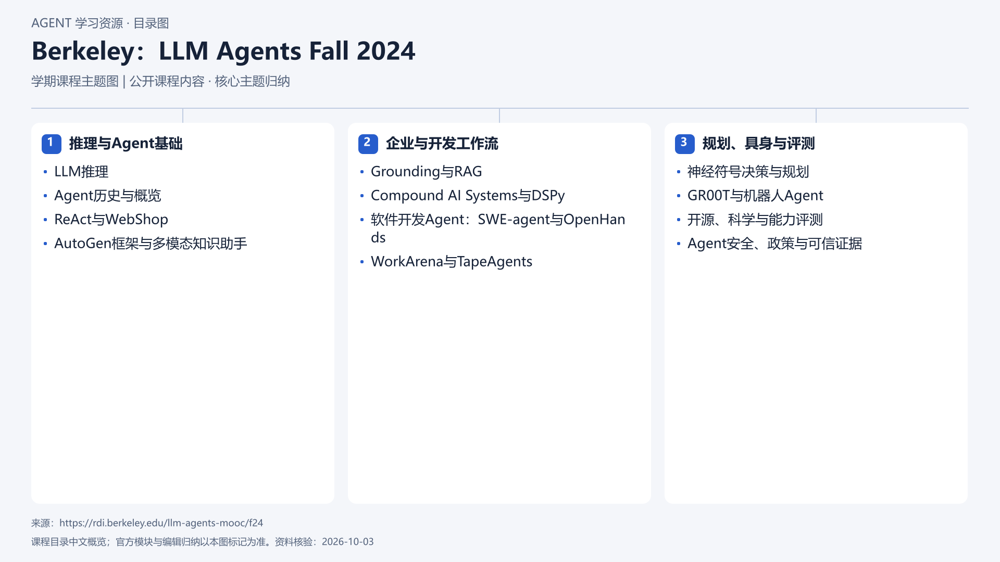

# Berkeley：LLM Agents Fall 2024

[返回总目录](../../README.md) · [官网](https://rdi.berkeley.edu/llm-agents-mooc/f24) · [学后评价](review.md)

## 目录依据

依据F24官方大纲的12场公开讲座顺序压缩归纳；不同学期不合并。

[可编辑 SVG](../../assets/course_maps/svg/berkeley-llm-agents-fall-2024.svg)

## 内容地图

### 推理与Agent基础

- LLM推理
- Agent历史与概览
- ReAct与WebShop
- AutoGen框架与多模态知识助手

### 企业与开发工作流

- Grounding与RAG
- Compound AI Systems与DSPy
- 软件开发Agent：SWE-agent与OpenHands
- WorkArena与TapeAgents

### 规划、具身与评测

- 神经符号决策与规划
- GR00T与机器人Agent
- 开源、科学与能力评测
- Agent安全、政策与可信证据

## 相关研究

- [研究分析](../../research/agent_courses/providers/berkeley/analysis.md)（同一提供方可能涵盖多项资源）
- [详细章节地图](../../research/agent_courses/providers/berkeley/curriculum.md)（同一提供方可能涵盖多项资源）
- [证据与获取范围](../../research/agent_courses/providers/berkeley/evidence.md)（同一提供方可能涵盖多项资源）

## 相关目录

- [章节笔记](notes/README.md)
- [实践材料](practice/README.md)
- [课程评估](review.md)
