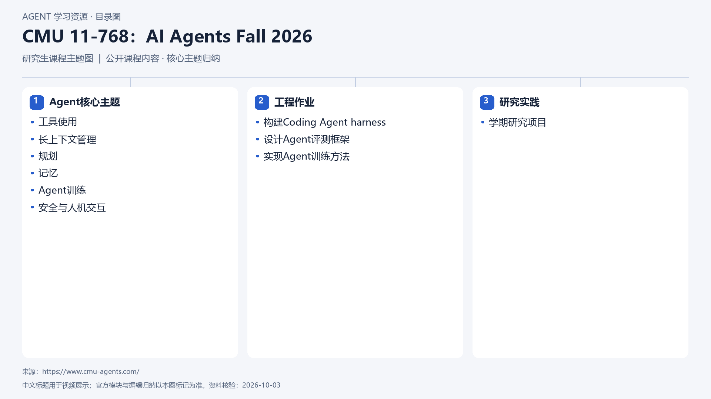

# CMU 11-768：AI Agents Fall 2026

[返回总目录](../../README.md) · [官网](https://www.cmu-agents.com/) · [学后评价](review.md)

状态：待开始个人学习。当前内容为资料整理，不代表课程已完成。

## 目录依据

依据课程站公开安排、主题与作业说明归纳；课程于2026年秋季进行中，课堂和作业访问以课程站为准。

[可编辑 SVG](../../assets/course_maps/svg/cmu-11768-ai-agents-fall-2026.svg)

## 内容地图

### Agent核心主题

- 工具使用
- 长上下文管理
- 规划
- 记忆
- Agent训练
- 安全与人机交互

### 工程作业

- 构建Coding Agent harness
- 设计Agent评测框架
- 实现Agent训练方法

### 研究实践

- 学期研究项目

## 相关研究

- [公开课程补充研究](../../research/agent_courses/additional_open_courses.md)

## 我的学习记录

- [章节笔记](notes/README.md)
- [实践与 Demo](practice/README.md)
- [学后评价](review.md)

可以按 `notes/01-主题.md` 新建笔记；每次记录原课链接、理解、疑问与验证结果。
