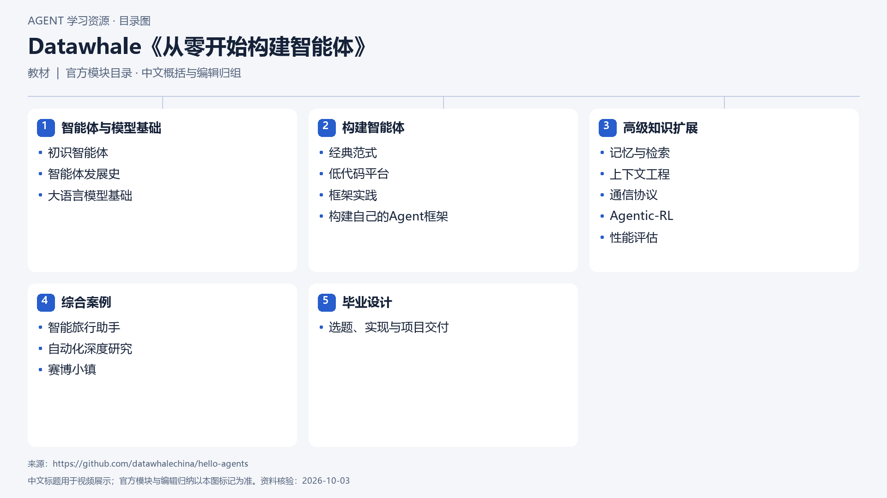

# Datawhale《从零开始构建智能体》

[返回总目录](../../README.md) · [官网](https://github.com/datawhalechina/hello-agents) · [学后评价](review.md)

状态：待开始个人学习。当前内容为资料整理，不代表课程已完成。

## 目录依据

官方目录（16章按原五部分收录）

[可编辑 SVG](../../assets/course_maps/svg/datawhale_hello_agents.svg)

## 内容地图

### 智能体与模型基础

- 初识智能体
- 智能体发展史
- 大语言模型基础

### 构建智能体

- 经典范式
- 低代码平台
- 框架实践
- 构建自己的Agent框架

### 高级知识扩展

- 记忆与检索
- 上下文工程
- 通信协议
- Agentic-RL
- 性能评估

### 综合案例

- 智能旅行助手
- 自动化深度研究
- 赛博小镇

### 毕业设计

- 选题、实现与项目交付

## 相关研究

- [研究分析](../../research/agent_courses/providers/datawhale/analysis.md)（同一提供方可能涵盖多项资源）
- [详细章节地图](../../research/agent_courses/providers/datawhale/curriculum.md)（同一提供方可能涵盖多项资源）
- [证据与获取范围](../../research/agent_courses/providers/datawhale/evidence.md)（同一提供方可能涵盖多项资源）

## 我的学习记录

- [章节笔记](notes/README.md)
- [实践与 Demo](practice/README.md)
- [学后评价](review.md)

可以按 `notes/01-主题.md` 新建笔记；每次记录原课链接、理解、疑问与验证结果。
