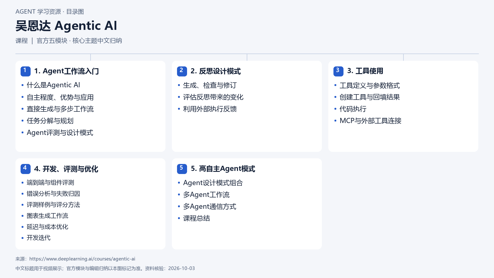

# 吴恩达 Agentic AI

[返回总目录](../../README.md) · [官网](https://www.deeplearning.ai/courses/agentic-ai) · [学后评价](review.md)

状态：待开始个人学习。当前内容为资料整理，不代表课程已完成。

## 目录依据

官方五模块顺序；依据公开目录与课文归纳核心主题，非全部31节逐课清单

[可编辑 SVG](../../assets/course_maps/svg/deeplearning_ai_agentic_ai.svg)

## 内容地图

### 1. Agent工作流入门

- 什么是Agentic AI
- 自主程度、优势与应用
- 直接生成与多步工作流
- 任务分解与规划
- Agent评测与设计模式

### 2. 反思设计模式

- 生成、检查与修订
- 评估反思带来的变化
- 利用外部执行反馈

### 3. 工具使用

- 工具定义与参数格式
- 创建工具与回填结果
- 代码执行
- MCP与外部工具连接

### 4. 开发、评测与优化

- 端到端与组件评测
- 错误分析与失败归因
- 评测样例与评分方法
- 图表生成工作流
- 延迟与成本优化
- 开发迭代

### 5. 高自主Agent模式

- Agent设计模式组合
- 多Agent工作流
- 多Agent通信方式
- 课程总结

## 相关研究

- [研究分析](../../research/agent_courses/providers/deeplearning_ai/analysis.md)（同一提供方可能涵盖多项资源）
- [详细章节地图](../../research/agent_courses/providers/deeplearning_ai/curriculum.md)（同一提供方可能涵盖多项资源）
- [证据与获取范围](../../research/agent_courses/providers/deeplearning_ai/evidence.md)（同一提供方可能涵盖多项资源）

## 我的学习记录

- [章节笔记](notes/README.md)
- [实践与 Demo](practice/README.md)
- [学后评价](review.md)

可以按 `notes/01-主题.md` 新建笔记；每次记录原课链接、理解、疑问与验证结果。
