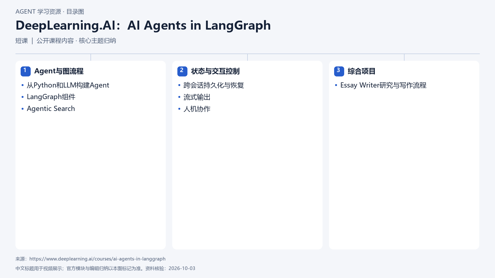

# DeepLearning.AI：AI Agents in LangGraph

[返回总目录](../../README.md) · [官网](https://www.deeplearning.ai/courses/ai-agents-in-langgraph) · [学后评价](review.md)

状态：待开始个人学习。当前内容为资料整理，不代表课程已完成。

## 目录依据

依据官方课程目录与简介归纳；课程页列中级、9节视频和6个代码示例，未运行练习。

[可编辑 SVG](../../assets/course_maps/svg/dlai-ai-agents-in-langgraph.svg)

## 内容地图

### Agent与图流程

- 从Python和LLM构建Agent
- LangGraph组件
- Agentic Search

### 状态与交互控制

- 跨会话持久化与恢复
- 流式输出
- 人机协作

### 综合项目

- Essay Writer研究与写作流程

## 相关研究

- [研究分析](../../research/agent_courses/providers/deeplearning_ai/analysis.md)（同一提供方可能涵盖多项资源）
- [详细章节地图](../../research/agent_courses/providers/deeplearning_ai/curriculum.md)（同一提供方可能涵盖多项资源）
- [证据与获取范围](../../research/agent_courses/providers/deeplearning_ai/evidence.md)（同一提供方可能涵盖多项资源）

## 我的学习记录

- [章节笔记](notes/README.md)
- [实践与 Demo](practice/README.md)
- [学后评价](review.md)

可以按 `notes/01-主题.md` 新建笔记；每次记录原课链接、理解、疑问与验证结果。
