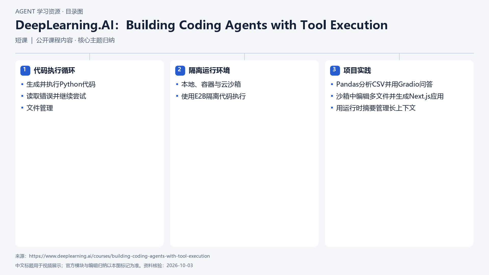

# DeepLearning.AI：Building Coding Agents with Tool Execution

[返回总目录](../../README.md) · [官网](https://www.deeplearning.ai/courses/building-coding-agents-with-tool-execution) · [学后评价](review.md)

状态：待开始个人学习。当前内容为资料整理，不代表课程已完成。

## 目录依据

依据官方课程目录与简介归纳；课程页列中级、9节视频和5个代码示例，未运行项目。

[可编辑 SVG](../../assets/course_maps/svg/dlai-building-coding-agents-tool-execution.svg)

## 内容地图

### 代码执行循环

- 生成并执行Python代码
- 读取错误并继续尝试
- 文件管理

### 隔离运行环境

- 本地、容器与云沙箱
- 使用E2B隔离代码执行

### 项目实践

- Pandas分析CSV并用Gradio问答
- 沙箱中编辑多文件并生成Next.js应用
- 用运行时摘要管理长上下文

## 相关研究

- [研究分析](../../research/agent_courses/providers/deeplearning_ai/analysis.md)（同一提供方可能涵盖多项资源）
- [详细章节地图](../../research/agent_courses/providers/deeplearning_ai/curriculum.md)（同一提供方可能涵盖多项资源）
- [证据与获取范围](../../research/agent_courses/providers/deeplearning_ai/evidence.md)（同一提供方可能涵盖多项资源）

## 我的学习记录

- [章节笔记](notes/README.md)
- [实践与 Demo](practice/README.md)
- [学后评价](review.md)

可以按 `notes/01-主题.md` 新建笔记；每次记录原课链接、理解、疑问与验证结果。
