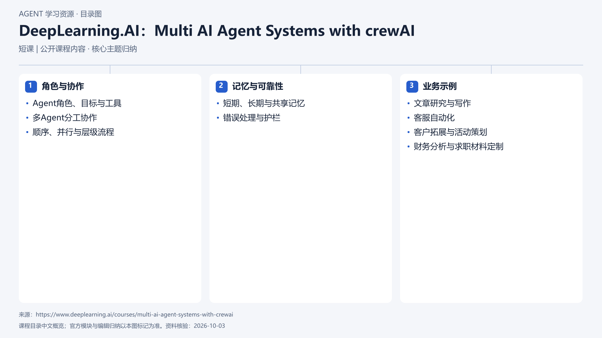

# DeepLearning.AI：Multi AI Agent Systems with crewAI

[返回总目录](../../README.md) · [官网](https://www.deeplearning.ai/courses/multi-ai-agent-systems-with-crewai) · [学后评价](review.md)

## 目录依据

依据官方课程目录、简介与代码示例方向归纳；课程页列初级、18节视频和7个代码示例，未运行练习。

[可编辑 SVG](../../assets/course_maps/svg/dlai-multi-ai-agent-systems-crewai.svg)

## 内容地图

### 角色与协作

- Agent角色、目标与工具
- 多Agent分工协作
- 顺序、并行与层级流程

### 记忆与可靠性

- 短期、长期与共享记忆
- 错误处理与护栏

### 业务示例

- 文章研究与写作
- 客服自动化
- 客户拓展与活动策划
- 财务分析与求职材料定制

## 相关研究

- [研究分析](../../research/agent_courses/providers/deeplearning_ai/analysis.md)（同一提供方可能涵盖多项资源）
- [详细章节地图](../../research/agent_courses/providers/deeplearning_ai/curriculum.md)（同一提供方可能涵盖多项资源）
- [证据与获取范围](../../research/agent_courses/providers/deeplearning_ai/evidence.md)（同一提供方可能涵盖多项资源）

## 相关目录

- [章节笔记](notes/README.md)
- [实践材料](practice/README.md)
- [课程评估](review.md)
