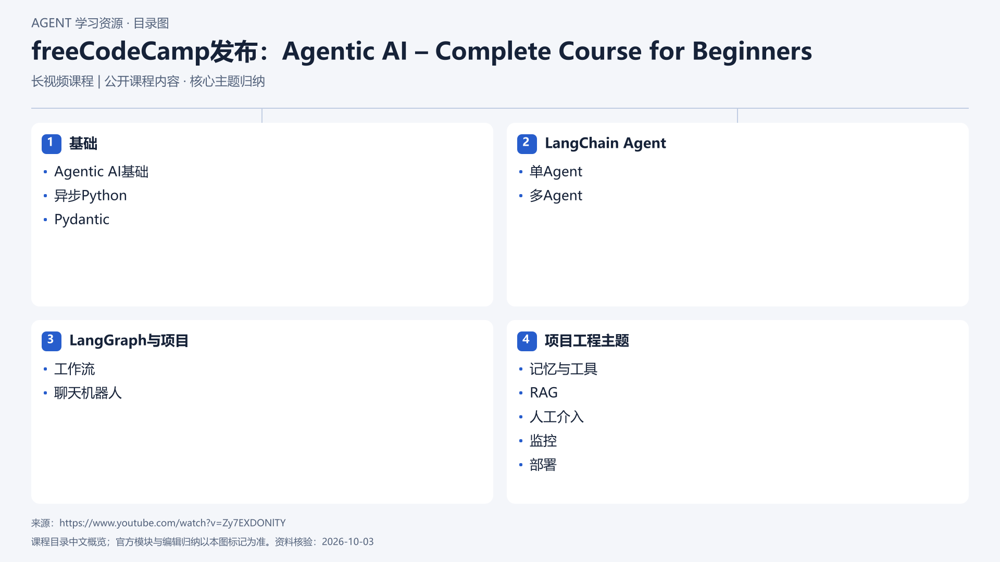

# freeCodeCamp发布：Agentic AI – Complete Course for Beginners

[返回总目录](../../README.md) · [官网](https://www.youtube.com/watch?v=Zy7EXDONlTY) · [学后评价](review.md)

## 目录依据

按本地审阅的课程与配套代码主题顺序

[可编辑 SVG](../../assets/course_maps/svg/freecodecamp_agentic_ai.svg)

## 内容地图

### 基础

- Agentic AI基础
- 异步Python
- Pydantic

### LangChain Agent

- 单Agent
- 多Agent

### LangGraph与项目

- 工作流
- 聊天机器人

### 项目工程主题

- 记忆与工具
- RAG
- 人工介入
- 监控
- 部署

## 相关研究

- [公开课程补充研究](../../research/agent_courses/additional_open_courses.md)

## 相关目录

- [章节笔记](notes/README.md)
- [实践材料](practice/README.md)
- [课程评估](review.md)
