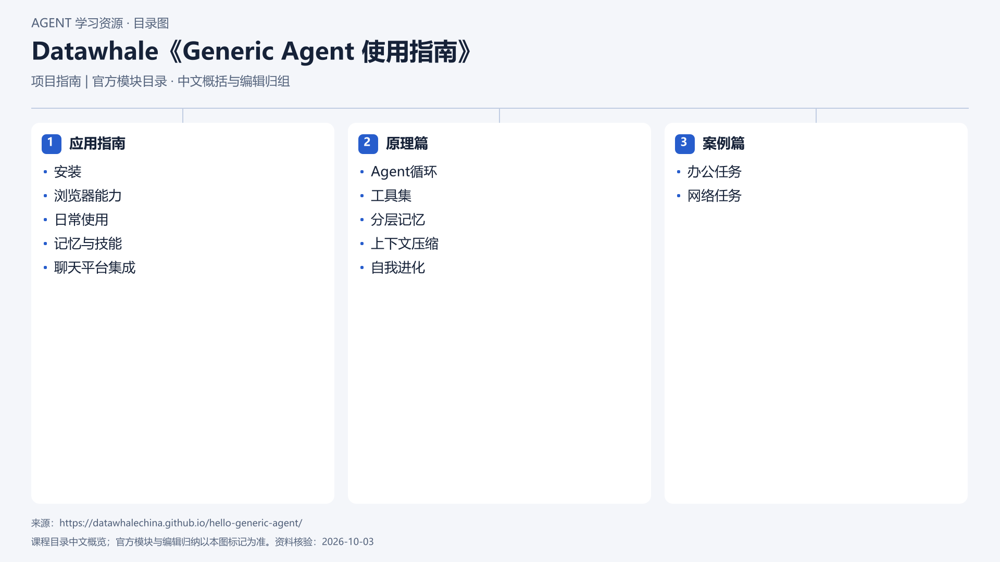

# Datawhale《Generic Agent 使用指南》

[返回总目录](../../README.md) · [官网](https://datawhalechina.github.io/hello-generic-agent/) · [学后评价](review.md)

## 目录依据

官方目录三篇结构（中文概括）

[可编辑 SVG](../../assets/course_maps/svg/generic_agent.svg)

## 内容地图

### 应用指南

- 安装
- 浏览器能力
- 日常使用
- 记忆与技能
- 聊天平台集成

### 原理篇

- Agent循环
- 工具集
- 分层记忆
- 上下文压缩
- 自我进化

### 案例篇

- 办公任务
- 网络任务

## 相关研究

- [公开课程补充研究](../../research/agent_courses/additional_open_courses.md)

## 相关目录

- [章节笔记](notes/README.md)
- [实践材料](practice/README.md)
- [课程评估](review.md)
