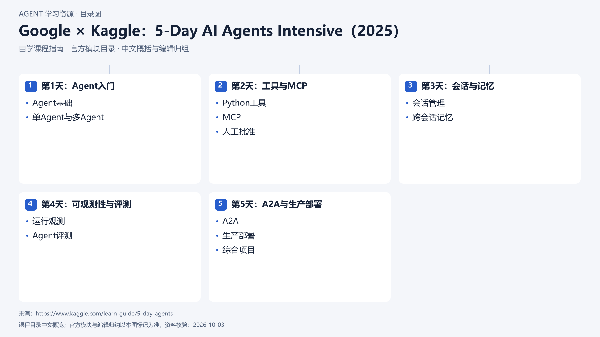

# Google × Kaggle：5-Day AI Agents Intensive（2025）

[返回总目录](../../README.md) · [官网](https://www.kaggle.com/learn-guide/5-day-agents) · [学后评价](review.md)

## 目录依据

官方五日主题顺序（中文概括）

[可编辑 SVG](../../assets/course_maps/svg/google_agents_2025.svg)

## 内容地图

### 第1天：Agent入门

- Agent基础
- 单Agent与多Agent

### 第2天：工具与MCP

- Python工具
- MCP
- 人工批准

### 第3天：会话与记忆

- 会话管理
- 跨会话记忆

### 第4天：可观测性与评测

- 运行观测
- Agent评测

### 第5天：A2A与生产部署

- A2A
- 生产部署
- 综合项目

## 相关研究

- [公开课程补充研究](../../research/agent_courses/additional_open_courses.md)

## 相关目录

- [章节笔记](notes/README.md)
- [实践材料](practice/README.md)
- [课程评估](review.md)
