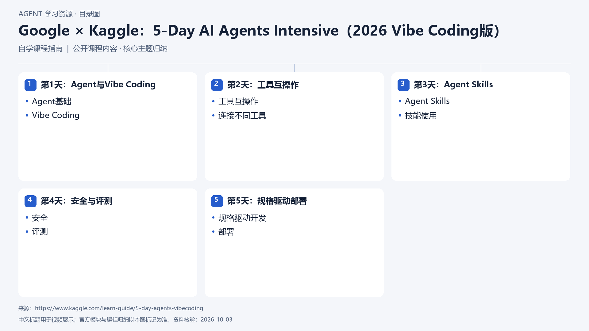

# Google × Kaggle：5-Day AI Agents Intensive（2026 Vibe Coding版）

[返回总目录](../../README.md) · [官网](https://www.kaggle.com/learn-guide/5-day-agents-vibecoding) · [学后评价](review.md)

状态：待开始个人学习。当前内容为资料整理，不代表课程已完成。

## 目录依据

已核实资料列出的新版五日主题顺序；与2025版分开

[可编辑 SVG](../../assets/course_maps/svg/google_agents_2026_vibecoding.svg)

## 内容地图

### 第1天：Agent与Vibe Coding

- Agent基础
- Vibe Coding

### 第2天：工具互操作

- 工具互操作
- 连接不同工具

### 第3天：Agent Skills

- Agent Skills
- 技能使用

### 第4天：安全与评测

- 安全
- 评测

### 第5天：规格驱动部署

- 规格驱动开发
- 部署

## 相关研究

- [公开课程补充研究](../../research/agent_courses/additional_open_courses.md)

## 我的学习记录

- [章节笔记](notes/README.md)
- [实践与 Demo](practice/README.md)
- [学后评价](review.md)

可以按 `notes/01-主题.md` 新建笔记；每次记录原课链接、理解、疑问与验证结果。
