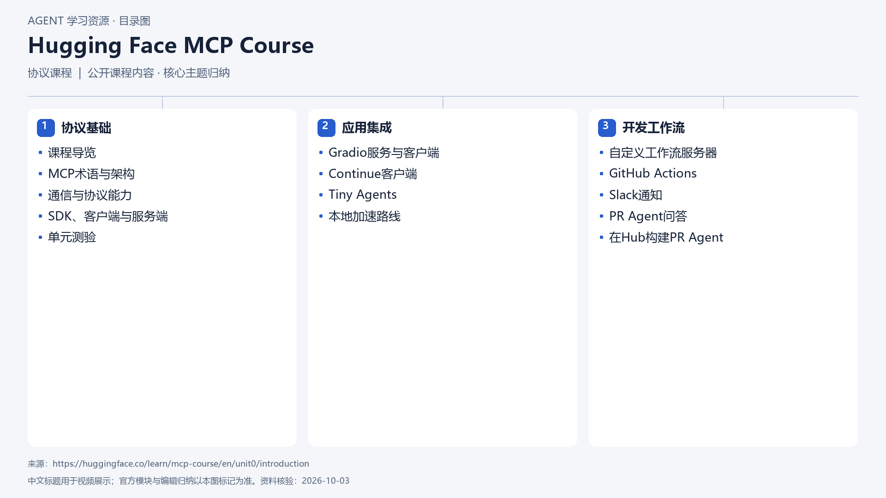

# Hugging Face MCP Course

[返回总目录](../../README.md) · [官网](https://huggingface.co/learn/mcp-course/en/unit0/introduction) · [学后评价](review.md)

状态：待开始个人学习。当前内容为资料整理，不代表课程已完成。

## 目录依据

依据官方英文目录归纳，覆盖 Unit 0 至 Unit 3.1；记录确认目录与项目方向，未逐课评测。

[可编辑 SVG](../../assets/course_maps/svg/huggingface-mcp.svg)

## 内容地图

### 协议基础

- 课程导览
- MCP术语与架构
- 通信与协议能力
- SDK、客户端与服务端
- 单元测验

### 应用集成

- Gradio服务与客户端
- Continue客户端
- Tiny Agents
- 本地加速路线

### 开发工作流

- 自定义工作流服务器
- GitHub Actions
- Slack通知
- PR Agent问答
- 在Hub构建PR Agent

## 相关研究

- [研究分析](../../research/agent_courses/providers/extras/analysis.md)（同一提供方可能涵盖多项资源）

## 我的学习记录

- [章节笔记](notes/README.md)
- [实践与 Demo](practice/README.md)
- [学后评价](review.md)

可以按 `notes/01-主题.md` 新建笔记；每次记录原课链接、理解、疑问与验证结果。
