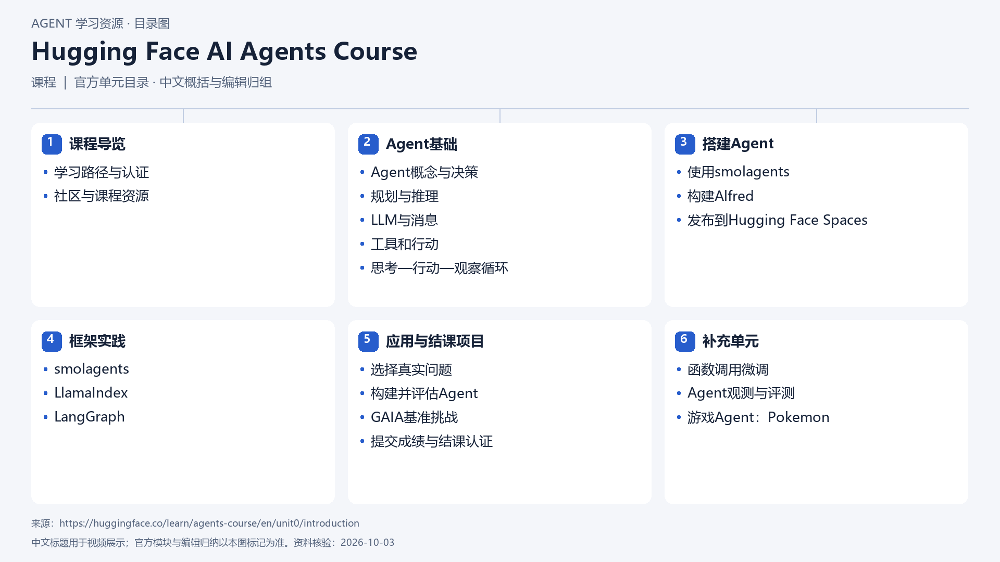

# Hugging Face AI Agents Course

[返回总目录](../../README.md) · [官网](https://huggingface.co/learn/agents-course/en/unit0/introduction) · [学后评价](review.md)

状态：待开始个人学习。当前内容为资料整理，不代表课程已完成。

## 目录依据

官方单元目录 · 基础、框架、项目与补充单元的中文归组

[可编辑 SVG](../../assets/course_maps/svg/huggingface_agents.svg)

## 内容地图

### 课程导览

- 学习路径与认证
- 社区与课程资源

### Agent基础

- Agent概念与决策
- 规划与推理
- LLM与消息
- 工具和行动
- 思考—行动—观察循环

### 搭建Agent

- 使用smolagents
- 构建Alfred
- 发布到Hugging Face Spaces

### 框架实践

- smolagents
- LlamaIndex
- LangGraph

### 应用与结课项目

- 选择真实问题
- 构建并评估Agent
- GAIA基准挑战
- 提交成绩与结课认证

### 补充单元

- 函数调用微调
- Agent观测与评测
- 游戏Agent：Pokemon

## 相关研究

- [研究分析](../../research/agent_courses/providers/huggingface/analysis.md)（同一提供方可能涵盖多项资源）
- [详细章节地图](../../research/agent_courses/providers/huggingface/curriculum.md)（同一提供方可能涵盖多项资源）
- [证据与获取范围](../../research/agent_courses/providers/huggingface/evidence.md)（同一提供方可能涵盖多项资源）

## 我的学习记录

- [章节笔记](notes/README.md)
- [实践与 Demo](practice/README.md)
- [学后评价](review.md)

可以按 `notes/01-主题.md` 新建笔记；每次记录原课链接、理解、疑问与验证结果。
