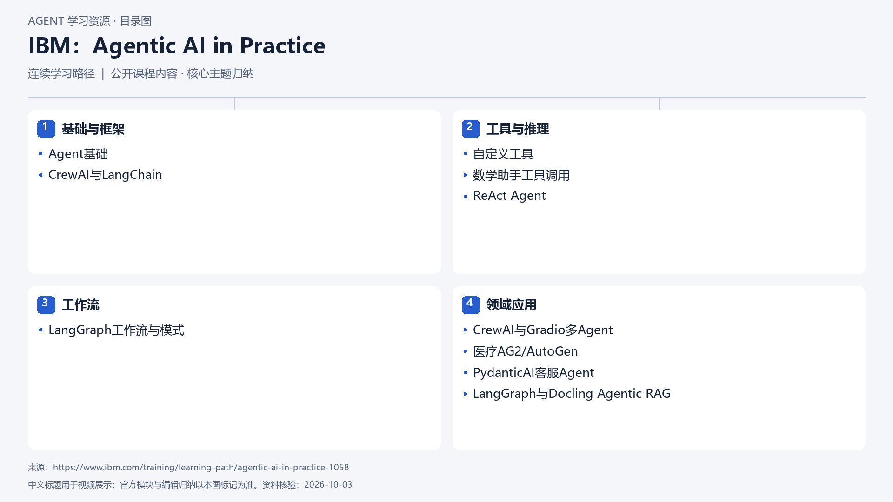

# IBM：Agentic AI in Practice

[返回总目录](../../README.md) · [官网](https://www.ibm.com/training/learning-path/agentic-ai-in-practice-1058) · [学后评价](review.md)

状态：待开始个人学习。当前内容为资料整理，不代表课程已完成。

## 目录依据

依据IBM Training公开路径目录归纳：1门课程、9个教程、四段；未核实统一先修条件与各教程运行环境。

[可编辑 SVG](../../assets/course_maps/svg/ibm-agentic-ai-in-practice.svg)

## 内容地图

### 基础与框架

- Agent基础
- CrewAI与LangChain

### 工具与推理

- 自定义工具
- 数学助手工具调用
- ReAct Agent

### 工作流

- LangGraph工作流与模式

### 领域应用

- CrewAI与Gradio多Agent
- 医疗AG2/AutoGen
- PydanticAI客服Agent
- LangGraph与Docling Agentic RAG

## 相关研究

- [厂商课程研究记录](../../research/agent_courses/additional_vendor_courses.md)

## 我的学习记录

- [章节笔记](notes/README.md)
- [实践与 Demo](practice/README.md)
- [学后评价](review.md)

可以按 `notes/01-主题.md` 新建笔记；每次记录原课链接、理解、疑问与验证结果。
