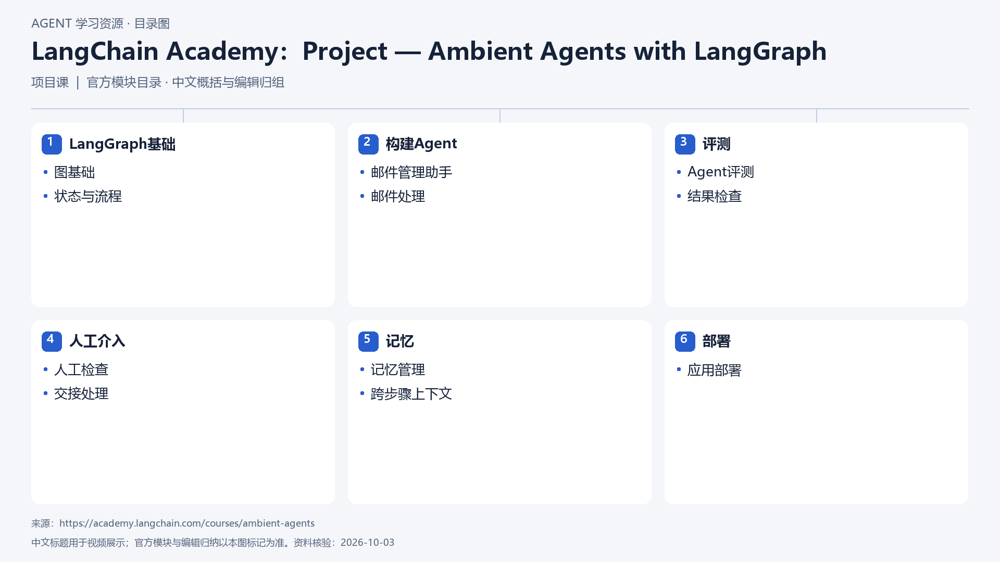

# LangChain Academy：Project — Ambient Agents with LangGraph

[返回总目录](../../README.md) · [官网](https://academy.langchain.com/courses/ambient-agents) · [学后评价](review.md)

状态：待开始个人学习。当前内容为资料整理，不代表课程已完成。

## 目录依据

官方六模块顺序，按本地课程目录记录

[可编辑 SVG](../../assets/course_maps/svg/langchain_ambient_agents.svg)

## 内容地图

### LangGraph基础

- 图基础
- 状态与流程

### 构建Agent

- 邮件管理助手
- 邮件处理

### 评测

- Agent评测
- 结果检查

### 人工介入

- 人工检查
- 交接处理

### 记忆

- 记忆管理
- 跨步骤上下文

### 部署

- 应用部署

## 相关研究

- [研究分析](../../research/agent_courses/providers/langchain/analysis.md)（同一提供方可能涵盖多项资源）
- [详细章节地图](../../research/agent_courses/providers/langchain/curriculum.md)（同一提供方可能涵盖多项资源）
- [证据与获取范围](../../research/agent_courses/providers/langchain/evidence.md)（同一提供方可能涵盖多项资源）

## 我的学习记录

- [章节笔记](notes/README.md)
- [实践与 Demo](practice/README.md)
- [学后评价](review.md)

可以按 `notes/01-主题.md` 新建笔记；每次记录原课链接、理解、疑问与验证结果。
