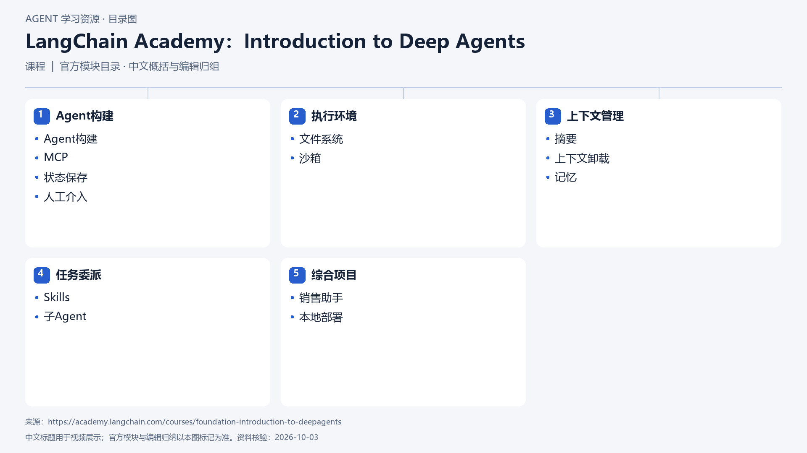

# LangChain Academy：Introduction to Deep Agents

[返回总目录](../../README.md) · [官网](https://academy.langchain.com/courses/foundation-introduction-to-deepagents) · [学后评价](review.md)

状态：待开始个人学习。当前内容为资料整理，不代表课程已完成。

## 目录依据

官方五模块顺序，按本地课程目录记录

[可编辑 SVG](../../assets/course_maps/svg/langchain_deep_agents.svg)

## 内容地图

### Agent构建

- Agent构建
- MCP
- 状态保存
- 人工介入

### 执行环境

- 文件系统
- 沙箱

### 上下文管理

- 摘要
- 上下文卸载
- 记忆

### 任务委派

- Skills
- 子Agent

### 综合项目

- 销售助手
- 本地部署

## 相关研究

- [研究分析](../../research/agent_courses/providers/langchain/analysis.md)（同一提供方可能涵盖多项资源）
- [详细章节地图](../../research/agent_courses/providers/langchain/curriculum.md)（同一提供方可能涵盖多项资源）
- [证据与获取范围](../../research/agent_courses/providers/langchain/evidence.md)（同一提供方可能涵盖多项资源）

## 我的学习记录

- [章节笔记](notes/README.md)
- [实践与 Demo](practice/README.md)
- [学后评价](review.md)

可以按 `notes/01-主题.md` 新建笔记；每次记录原课链接、理解、疑问与验证结果。
