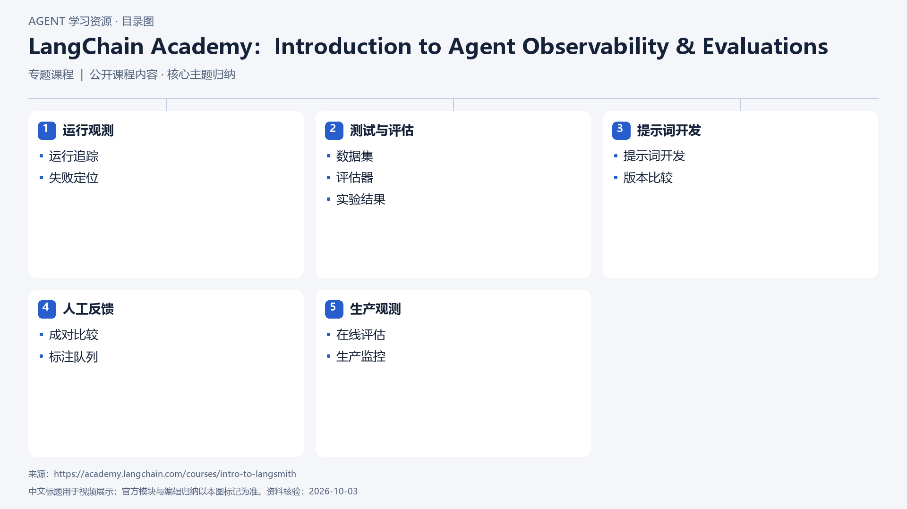

# LangChain Academy：Introduction to Agent Observability & Evaluations

[返回总目录](../../README.md) · [官网](https://academy.langchain.com/courses/intro-to-langsmith) · [学后评价](review.md)

状态：待开始个人学习。当前内容为资料整理，不代表课程已完成。

## 目录依据

按本地记录的官方课程主线顺序

[可编辑 SVG](../../assets/course_maps/svg/langchain_observability_evaluations.svg)

## 内容地图

### 运行观测

- 运行追踪
- 失败定位

### 测试与评估

- 数据集
- 评估器
- 实验结果

### 提示词开发

- 提示词开发
- 版本比较

### 人工反馈

- 成对比较
- 标注队列

### 生产观测

- 在线评估
- 生产监控

## 相关研究

- [研究分析](../../research/agent_courses/providers/langchain/analysis.md)（同一提供方可能涵盖多项资源）
- [详细章节地图](../../research/agent_courses/providers/langchain/curriculum.md)（同一提供方可能涵盖多项资源）
- [证据与获取范围](../../research/agent_courses/providers/langchain/evidence.md)（同一提供方可能涵盖多项资源）

## 我的学习记录

- [章节笔记](notes/README.md)
- [实践与 Demo](practice/README.md)
- [学后评价](review.md)

可以按 `notes/01-主题.md` 新建笔记；每次记录原课链接、理解、疑问与验证结果。
