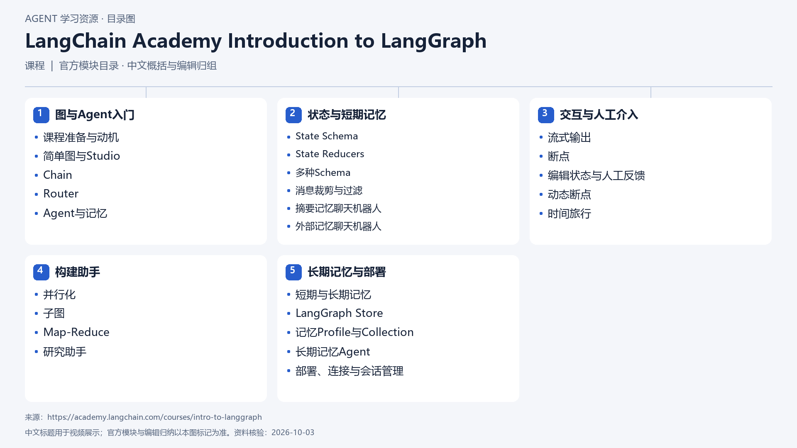

# LangChain Academy Introduction to LangGraph

[返回总目录](../../README.md) · [官网](https://academy.langchain.com/courses/intro-to-langgraph) · [学后评价](review.md)

状态：待开始个人学习。当前内容为资料整理，不代表课程已完成。

## 目录依据

官方目录（相邻模块编辑归组，模块内保持课序）

[可编辑 SVG](../../assets/course_maps/svg/langgraph_fundamentals.svg)

## 内容地图

### 图与Agent入门

- 课程准备与动机
- 简单图与Studio
- Chain
- Router
- Agent与记忆

### 状态与短期记忆

- State Schema
- State Reducers
- 多种Schema
- 消息裁剪与过滤
- 摘要记忆聊天机器人
- 外部记忆聊天机器人

### 交互与人工介入

- 流式输出
- 断点
- 编辑状态与人工反馈
- 动态断点
- 时间旅行

### 构建助手

- 并行化
- 子图
- Map-Reduce
- 研究助手

### 长期记忆与部署

- 短期与长期记忆
- LangGraph Store
- 记忆Profile与Collection
- 长期记忆Agent
- 部署、连接与会话管理

## 相关研究

- [研究分析](../../research/agent_courses/providers/langchain/analysis.md)（同一提供方可能涵盖多项资源）
- [详细章节地图](../../research/agent_courses/providers/langchain/curriculum.md)（同一提供方可能涵盖多项资源）
- [证据与获取范围](../../research/agent_courses/providers/langchain/evidence.md)（同一提供方可能涵盖多项资源）

## 我的学习记录

- [章节笔记](notes/README.md)
- [实践与 Demo](practice/README.md)
- [学后评价](review.md)

可以按 `notes/01-主题.md` 新建笔记；每次记录原课链接、理解、疑问与验证结果。
