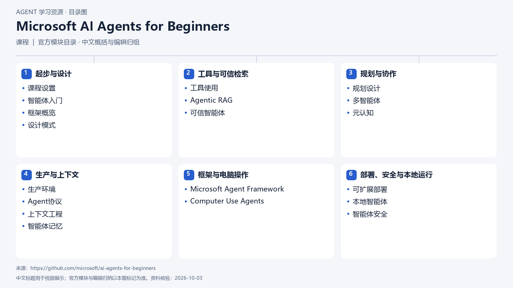

# Microsoft AI Agents for Beginners

[返回总目录](../../README.md) · [官网](https://github.com/microsoft/ai-agents-for-beginners) · [学后评价](review.md)

状态：待开始个人学习。当前内容为资料整理，不代表课程已完成。

## 目录依据

官方目录（连续课次编辑归组，组内保持课序）

[可编辑 SVG](../../assets/course_maps/svg/microsoft_ai_agents.svg)

## 内容地图

### 起步与设计

- 课程设置
- 智能体入门
- 框架概览
- 设计模式

### 工具与可信检索

- 工具使用
- Agentic RAG
- 可信智能体

### 规划与协作

- 规划设计
- 多智能体
- 元认知

### 生产与上下文

- 生产环境
- Agent协议
- 上下文工程
- 智能体记忆

### 框架与电脑操作

- Microsoft Agent Framework
- Computer Use Agents

### 部署、安全与本地运行

- 可扩展部署
- 本地智能体
- 智能体安全

## 相关研究

- [研究分析](../../research/agent_courses/providers/microsoft/analysis.md)（同一提供方可能涵盖多项资源）
- [详细章节地图](../../research/agent_courses/providers/microsoft/curriculum.md)（同一提供方可能涵盖多项资源）
- [证据与获取范围](../../research/agent_courses/providers/microsoft/evidence.md)（同一提供方可能涵盖多项资源）

## 我的学习记录

- [章节笔记](notes/README.md)
- [实践与 Demo](practice/README.md)
- [学后评价](review.md)

可以按 `notes/01-主题.md` 新建笔记；每次记录原课链接、理解、疑问与验证结果。
