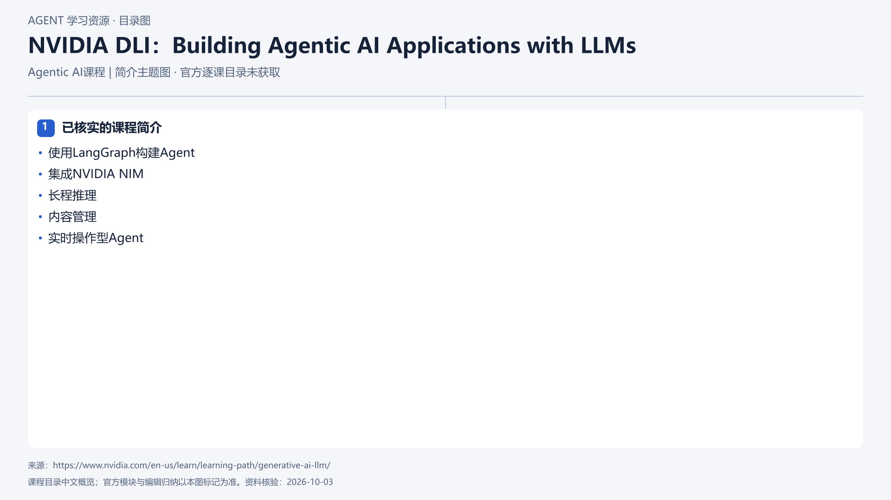

# NVIDIA DLI：Building Agentic AI Applications with LLMs

[返回总目录](../../README.md) · [官网](https://www.nvidia.com/en-us/learn/learning-path/generative-ai-llm/) · [学后评价](review.md)

## 目录依据

官方学习路径与证书备考路径可确认课程存在；课程简介提及LangGraph和NVIDIA NIM。详情页无逐节目录，主题仅按已核实简介归纳。

[可编辑 SVG](../../assets/course_maps/svg/nvidia-building-agentic-ai-applications.svg)

## 内容地图

### 已核实的课程简介

- 使用LangGraph构建Agent
- 集成NVIDIA NIM
- 长程推理
- 内容管理
- 实时操作型Agent

## 相关研究

- [厂商课程研究记录](../../research/agent_courses/additional_vendor_courses.md)

## 相关目录

- [章节笔记](notes/README.md)
- [实践材料](practice/README.md)
- [课程评估](review.md)
