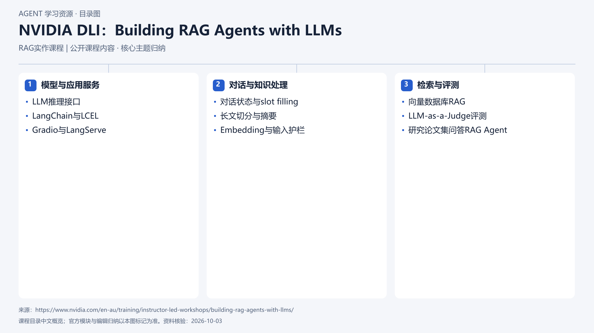

# NVIDIA DLI：Building RAG Agents with LLMs

[返回总目录](../../README.md) · [官网](https://www.nvidia.com/en-au/training/instructor-led-workshops/building-rag-agents-with-llms/) · [学后评价](review.md)

## 目录依据

依据NVIDIA官方课程页与目录审阅记录整理8小时模块；未运行课程代码。

[可编辑 SVG](../../assets/course_maps/svg/nvidia-building-rag-agents.svg)

## 内容地图

### 模型与应用服务

- LLM推理接口
- LangChain与LCEL
- Gradio与LangServe

### 对话与知识处理

- 对话状态与slot filling
- 长文切分与摘要
- Embedding与输入护栏

### 检索与评测

- 向量数据库RAG
- LLM-as-a-Judge评测
- 研究论文集问答RAG Agent

## 相关研究

- [厂商课程研究记录](../../research/agent_courses/additional_vendor_courses.md)

## 相关目录

- [章节笔记](notes/README.md)
- [实践材料](practice/README.md)
- [课程评估](review.md)
