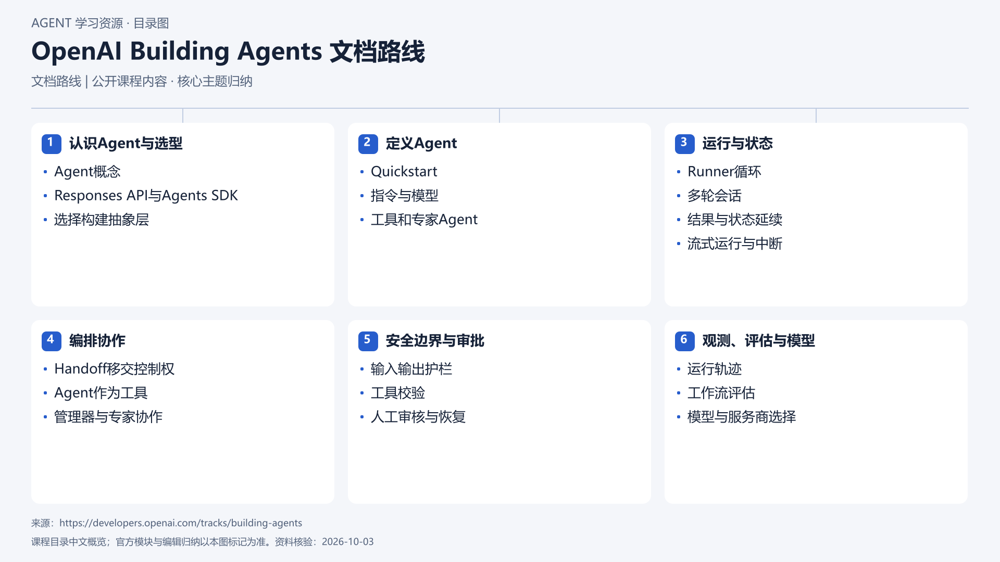

# OpenAI Building Agents 文档路线

[返回总目录](../../README.md) · [官网](https://developers.openai.com/tracks/building-agents) · [学后评价](review.md)

## 目录依据

依据公开官方材料整理的主题图（按建议阅读顺序编辑归组）

[可编辑 SVG](../../assets/course_maps/svg/openai_building_agents.svg)

## 内容地图

### 认识Agent与选型

- Agent概念
- Responses API与Agents SDK
- 选择构建抽象层

### 定义Agent

- Quickstart
- 指令与模型
- 工具和专家Agent

### 运行与状态

- Runner循环
- 多轮会话
- 结果与状态延续
- 流式运行与中断

### 编排协作

- Handoff移交控制权
- Agent作为工具
- 管理器与专家协作

### 安全边界与审批

- 输入输出护栏
- 工具校验
- 人工审核与恢复

### 观测、评估与模型

- 运行轨迹
- 工作流评估
- 模型与服务商选择

## 相关研究

- [研究分析](../../research/agent_courses/providers/openai/analysis.md)（同一提供方可能涵盖多项资源）
- [详细章节地图](../../research/agent_courses/providers/openai/curriculum.md)（同一提供方可能涵盖多项资源）
- [证据与获取范围](../../research/agent_courses/providers/openai/evidence.md)（同一提供方可能涵盖多项资源）

## 相关目录

- [章节笔记](notes/README.md)
- [实践材料](practice/README.md)
- [课程评估](review.md)
