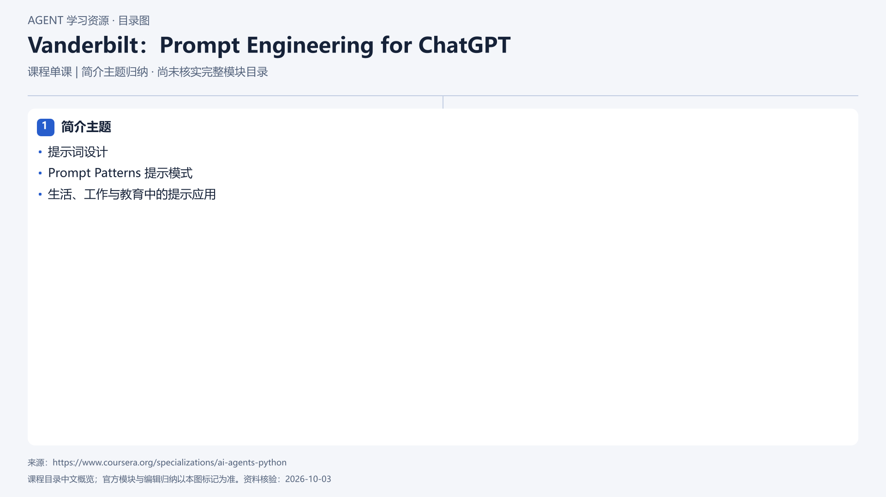

# Vanderbilt：Prompt Engineering for ChatGPT

[返回总目录](../../README.md) · [官网](https://www.coursera.org/specializations/ai-agents-python) · [学后评价](review.md)

## 目录依据

简介主题归纳；尚未核实完整模块目录

[可编辑 SVG](../../assets/course_maps/svg/vanderbilt_prompt_engineering.svg)

## 内容地图

### 简介主题

- 提示词设计
- Prompt Patterns 提示模式
- 生活、工作与教育中的提示应用

## 相关研究

- [系列课程的研究记录](../../research/agent_courses/additional_framework_university_courses.md)

## 相关目录

- [章节笔记](notes/README.md)
- [实践材料](practice/README.md)
- [课程评估](review.md)
