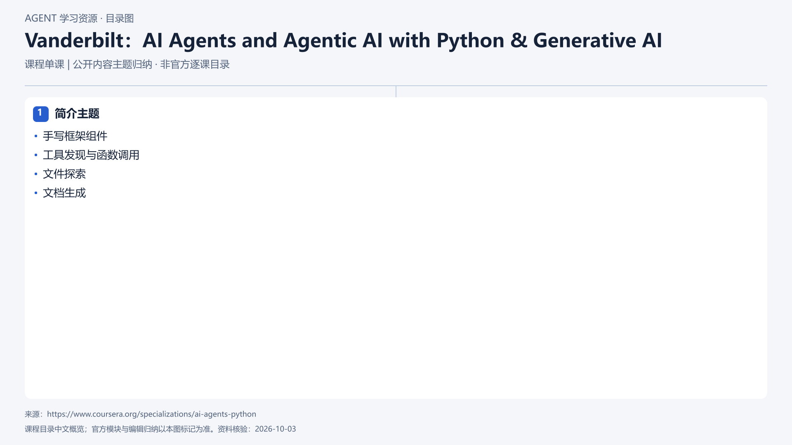

# Vanderbilt：AI Agents and Agentic AI with Python & Generative AI

[返回总目录](../../README.md) · [官网](https://www.coursera.org/specializations/ai-agents-python) · [学后评价](review.md)

## 目录依据

简介主题归纳；已核实资料未提供该单课完整目录

[可编辑 SVG](../../assets/course_maps/svg/vanderbilt_python_agent_implementation.svg)

## 内容地图

### 简介主题

- 手写框架组件
- 工具发现与函数调用
- 文件探索
- 文档生成

## 相关研究

- [系列课程的研究记录](../../research/agent_courses/additional_framework_university_courses.md)

## 相关目录

- [章节笔记](notes/README.md)
- [实践材料](practice/README.md)
- [课程评估](review.md)
